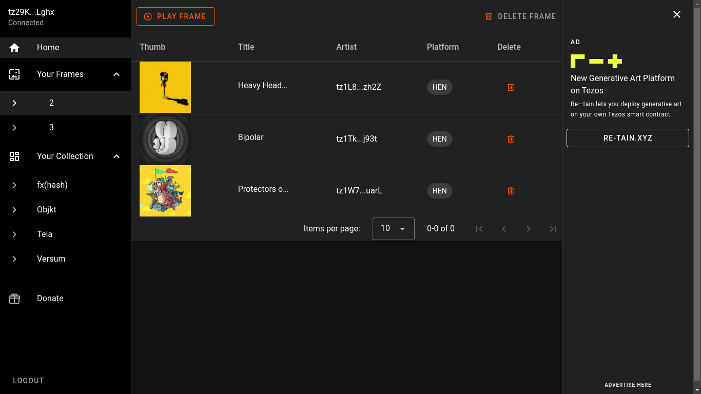

# ABOUT

DIYFRAME is a decentralized app on the Tezos blockchain that lets you display fxhash, objkt, teia and versum NFTs on any screen for free.

You can effortlessly turn your TV, monitor, projector, tablet, smartphone, or any device with a modern Chromium-based browser into an NFT display using DIYFRAME.

## Table of Contents
- [Features](#features)
- [Installation](#installation)
- [Usage](#usage)
- [Contributing](#contributing)
- [License](#license)

## Features

**Create Multiple Frames**: Whether you want to curate a playlist or showcase a single artwork, DIYFRAME empowers you to create multiple frames to suit your preferences.

**Showcase Digital Art**: With DIYFRAME, you can easily exhibit NFTs from popular platforms like fxhash, objkt, versum, and teia, expanding your display options.

**Manage Frames Remotely**: Enjoy the freedom to create and manage frames from anywhere, allowing you to stay in control of your NFT displays.

**Build your own setup**: DIYFRAME is designed to run smoothly on any device with a modern Chromium-based browser, giving you the flexibility to choose your preferred display method.

**Wide Range Of Supported File Formats**: DIYFRAME supports various file formats, including graphics, interactive content, audio, video, static images, and animated GIFs, providing you with endless possibilities for showcasing your NFTs.

## Hosting Requirments

Self-hosting the dApp requires no specific server or enabled services.
Just upload all files from your *dist* folder.

## Supported Marketplaces

- fxhash, https://fxhash.xyz
- versum, https://versum.xyz
- objkt, https://objkt.com
- teia, https://teia.art

## Installation

Install all dependencies:
`npm install`

Run the app locally for testing and debugging: 
`npm run serve`

Build the app for production:
`npm run build`

Compile the contract to Michelson code:
`npm run compile:contract`

Deploy the contract to the Tezos Ghostnet or Tezos Mainnet:
`npm run:deploy`

## Usage

Here is how to use the dApp.

### 1. You need a Tezos Wallet, it's free
Learn more about how to get one:
[tezos.com/create-wallet/](https://tezos.com/create-wallet/)

### 2 Buy some XTZ
XTZ is the coin of the Tezos blockchain.
You can buy XTZ on crypto platforms like Coinbase.
Learn more: [https://www.coinbase.com/how-to-buy/tezos](https://www.coinbase.com/how-to-buy/tezos)

### 3. Acquire NFTs 

These are the most popular NFT art marketplaces on Tezos:
- objkt, https://objkt.com
- fxhash, https://fxhash.xyz
- teia, https://teia.art

### 4. How to create a frame in the dApp
0. Open the dApp
1. Navigate to _Collection_
2. Click the _+_ icon to add an artwork
3. Choose _Add to a new frame_ in the dialog
4. Open your _Tezos wallet_ and approve the transaction to securely store your diyFrame on-chain

## License

MIT license.

## API: Share And Import Digital Art From Marketplaces To diyFrame

The diyFrame Share API makes it easy for your site visitors to add artworks to their diyFrames from a link on your webpage or app.

[Learn more about the diyFrame Share API](https://blog.diyframe.xyz/share-and-import-digital-art-from-marketplaces-to-diyframe/)

## Contribution Guidelines

Thank you for considering contributing to our project! We appreciate the time and effort you invest to help us improve. To ensure a smooth collaboration, please follow these guidelines:

# Reporting Issues

## Before You Report

Before opening a new issue, please make sure:

1. **Search for Existing Issues:** Check if someone else has already reported the same issue to avoid duplicates.

2. **Read Documentation:** Ensure the issue is not a result of misunderstanding or a lack of information by consulting the project documentation.

3. **Update to the Latest Version:** If possible, check if the issue still exists in the latest version of the project.

## How to Report

When reporting an issue, provide as much detail as possible to help us understand and resolve the problem efficiently. Include:

- **Version:** Mention the version of the project you are using.

- **Environment:** Specify your operating system, browser, or any other relevant environment information.

- **Reproducible Steps:** Clearly outline the steps to reproduce the issue. If applicable, include sample code or a link to a repository that demonstrates the problem.

- **Expected vs Actual Behavior:** Describe what you expected to happen and what actually happened.

- **Screenshots or Error Messages:** Include any visual cues or error messages that might be helpful in diagnosing the issue.

# Contributing Code

## Getting Started

1. **Fork the Repository:** Fork the project on GitHub and clone your fork to your local machine.

2. **Install Dependencies:** Follow the project's README or documentation to set up your development environment.

## Branching Strategy

- **Create a Feature Branch:** When working on a new feature or bug fix, create a new branch based on the main branch.

- **Branch Naming:** Use descriptive and meaningful names for your branches, e.g., feature/new-feature or bugfix/issue-123.

## Coding Standards

Follow the established coding standards for the project. If there are no specific guidelines, maintain consistency with the existing codebase.

## Pull Requests

1. **Create a Pull Request:** Open a pull request from your feature branch to the main branch of the original repository.

2. **Title and Description:** Provide a clear and concise title for your pull request. Include a detailed description of your changes, explaining the problem and solution.

3. **Reference Issues:** If your pull request addresses a specific issue, reference it in the description using keywords like "Closes #123" or "Fixes #456."

4. **Review Changes:** Be open to feedback and be willing to make changes based on code review.

5. **Squash Commits:** Before merging, squash your commits into a single, coherent commit.

6. **Update Documentation:** If your changes impact documentation, make sure to update it accordingly.

7. **Continuous Integration:** Ensure that all continuous integration checks pass before requesting a review.

# Code of Conduct

Please be respectful: Treat others with kindness, empathy, and respect. Disagreements and differences of opinion are inevitable, but it's important to engage in constructive and respectful discussions.

# License

By contributing to this project, you agree that your contributions will be licensed under the project's **MIT license**.

---

## Please Note 
The diyFrame brand and logo are owned by Andre Fuchs.  

---

## Disclaimer 
This project is provided as is, without any warranty or support. Use it at your own risk.
